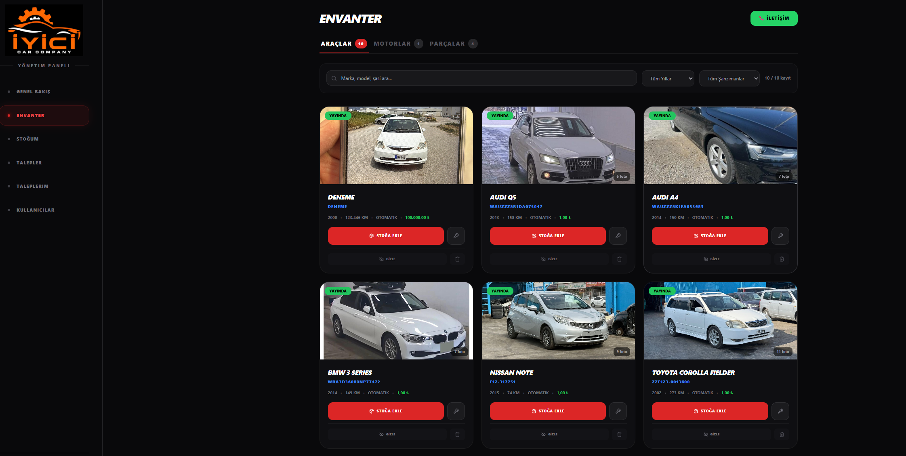
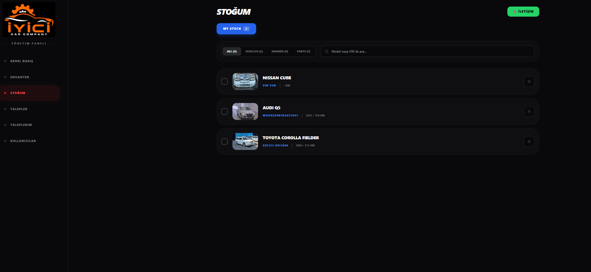
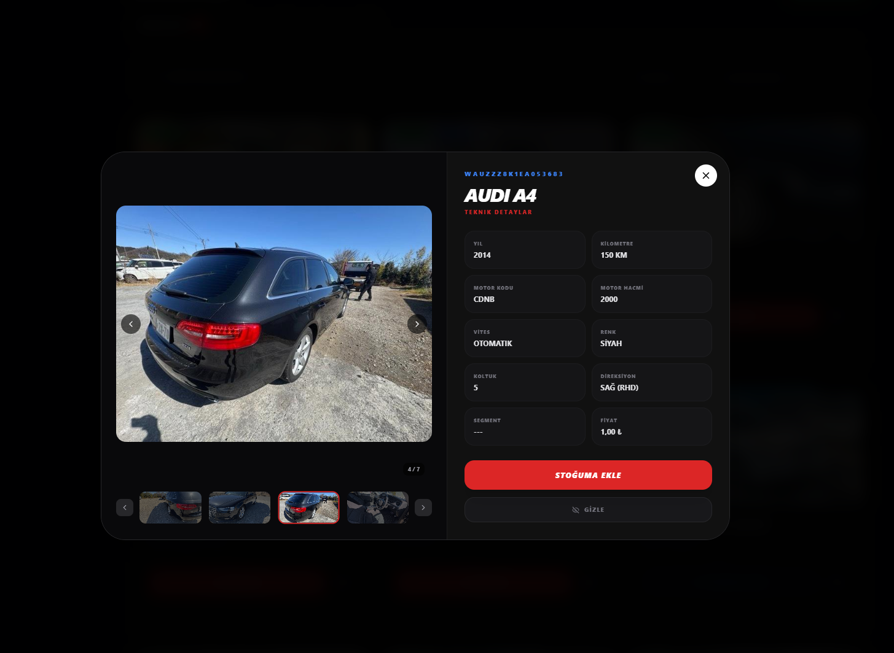
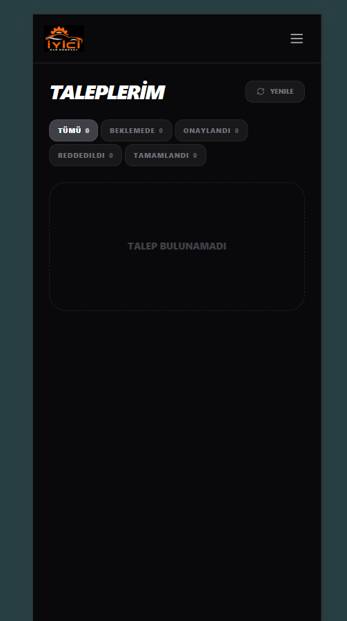

# 🚗 İyici Car — Vehicle Inventory Management System

A full-stack vehicle inventory management web application built with React and Supabase.

🔗 **Live Demo:** [iyici-car.netlify.app](https://iyici-car.netlify.app)



---

## Features

- **Authentication** — Email verification, role-based access (admin / user)
- **Admin Panel** — Create, delete, and manage user roles
- **Inventory Management** — Vehicles, engines, and parts with full CRUD
- **Photo Gallery** — Lightbox viewer with keyboard navigation
- **Price Management** — Support for 3 currencies
- **Search & Filter** — Category filtering, keyword search, pagination
- **Responsive Design** — Works on all screen sizes

---

## Screenshots

| Stock Management | Photo Gallery |
|---|---|
|  |  |

| Request Management |
|---|
|  |

---

## Tech Stack

| Layer | Technology |
|---|---|
| Frontend | React + Vite |
| Styling | Tailwind CSS |
| Backend | Supabase (PostgreSQL + Auth) |
| Storage | Supabase Storage |
| Hosting | Netlify |
| Icons | Lucide React |

---

## Getting Started

```bash
# Clone the repo
git clone https://github.com/mastartm/iyici_car.git
cd iyici_car

# Install dependencies
npm install

# Set up environment variables
cp .env.example .env
# Add your Supabase URL and anon key

# Start dev server
npm run dev
```

---

## Environment Variables

```
VITE_SUPABASE_URL=your_supabase_url
VITE_SUPABASE_ANON_KEY=your_supabase_anon_key
```

---

## Deployment

Auto-deploys to Netlify on every push to `main`.

---

*Built with React + Supabase*
